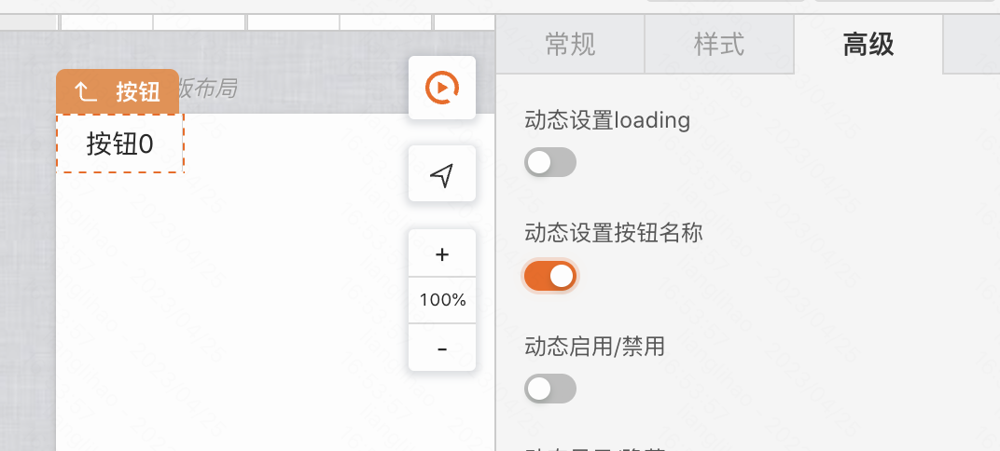
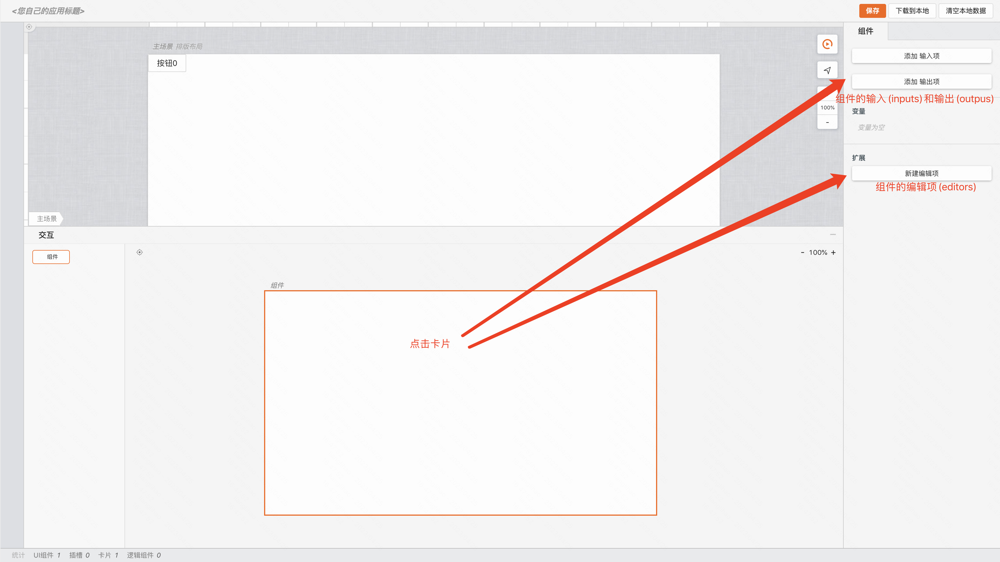
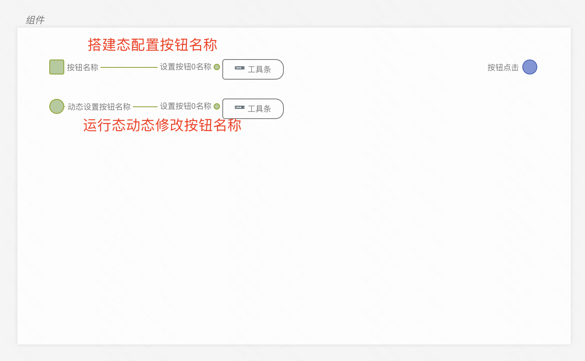
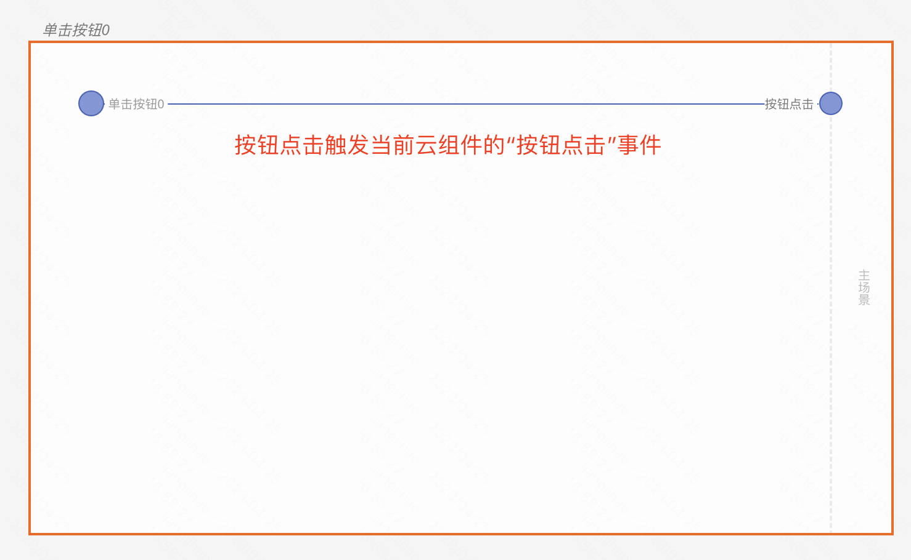
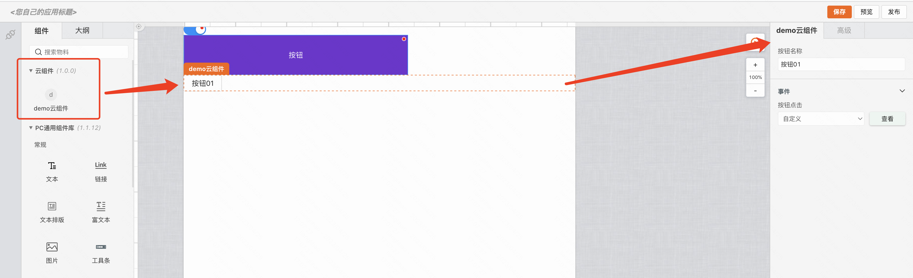

# 云组件

>**云组件** 是Mybricks生产物料、提升物料复用率、减少编码的重要组成部分。

## 搭建

>**云组件** 的搭建过程与demos下的普通PC页面基本一致，多出的可配置部分在于顶层逻辑卡片的IO能力。

### 引导
>下面将引导搭建一个云组件demo，包含了输入输出和可配置的能力。
#### 1. 添加一个工具条组件
将工具条的第一个按钮设置为“可动态设置按钮名称”



#### 2. 点击逻辑面板


可以看到右侧编辑栏有添加输入项、添加输出项以及新建编辑项按钮

我们一次点击三个按钮，这样，组件就拥有了一个输入项、一个输出项以及一个配置项。


#### 3. 通过连线来表达各个IO所需要完成的功能
实现的功能如下：
- 编辑态按钮名称配置
- 运行态动态修改按钮名称
- 运行态按钮点击输出



#### 4. 下载云组件产物并在demos/page-pc中使用
1. 点击右上角**下载到本地**按钮，将com.json文件复制到**demos/page-pc**下
2. **demos/page-pc**编写如下代码
``` javascript
// 导入com.json并通过run函数处理
import { run } from '@mybricks/render-com';
import com from './com.json';
run(com);

// comLibLoader
comLibLoader(desc) {
  return new Promise<string[]>((resolve, reject) => {
      window['__comlibs_edit_'] = [{
        title: '云组件',
        version: '1.0.0',
        comAray: [com]
      }]
      resolve([
        ...window['__comlibs_edit_'],
        `https://f2.eckwai.com/kos/nlav12333/fangzhou/pub/comlibs/5665_1.1.12/2023-03-31_12-19-17/edit.js`])
    })
  },
```

#### 5. 进入PC搭建页面，即可看到搭建的云组件

