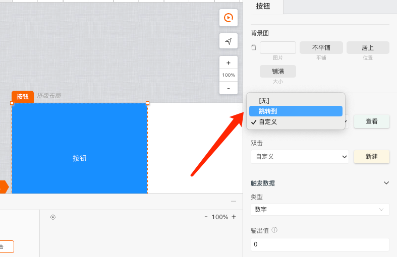

# mybricks-SPA引擎配置

>**mybricks-SPA** 是mybricks引擎家族面向单页应用的企业级设计引擎。
>
>本篇文章将介绍如何配置mybricks-SPA引擎，以便于在开发环境中使用。
>

<br/>

## 引擎在React中的使用
> mybricks-SPA引擎目前提供的是React版本，因此在使用mybricks-SPA引擎之前，需要先了解React的基本使用方法。

```typescript jsx
<Designer config={config} ref={designerRef}/>
//config 引擎配置项，designerRef 引擎实例
```


## 引擎配置（config）部分
mybricks-SPA引擎的配置包括以下两大部分：
### 全局配置
> 全局配置包括了组件库加载器、文件内容加载器、组件环境及扩展等内容

#### comLibLoader（组件库加载器）[必须]
```typescript jsx
const config = {
  //...
  comLibLoader() {
    return new Promise<string[]>((resolve, reject) => {
      //加载Mybricks的PC通用组件库
      resolve([`https://f2.eckwai.com/kos/nlav12333/fangzhou/pub/comlibs/5665_1.1.12/2023-03-31_12-19-17/edit.js`])
      //resolve([testLib])//也可以加载本地组件库
    })
  }
  //...
}
```

**注意：** 
- 组件库加载器必须返回一个Promise对象;
- 组件库可以是URL地址，也可以是一个本地组件库对象;

#### pageContentLoader（文件内容加载器）[必须]
> Mybricks的各类引擎在（编辑）内容加载、保存等方面，均已文件的形式进行。
```typescript jsx
const config = {
  //...
  pageContentLoader() {
    const pageContent = window.localStorage.getItem('--mybricks--')//本例中，直接从本地存储中加载
    return new Promise<string>((resolve, reject) => {
      let pageContent = window.localStorage.getItem('--mybricks--')
      if (pageContent) {
        pageContent = JSON.parse(pageContent)

        resolve(pageContent)
      } else {
        // resolve(null)
        // return
        import('./demo-data.json').then(data => {
          pageContent = JSON.parse(JSON.stringify(data))
          resolve(pageContent)
        })
      }
    })
  },
  //...
}
```

**注意：**
- 文件内容加载器必须返回一个Promise对象;
- 如果内容为空，返回null即可;


#### com（组件环境及扩展）[非必须]

```typescript jsx
const config = {
  //...
  com: {//配置组件运行时的环境扩展
    env: {
      i18n(title) {//多语言
        return title
      },
      callConnector(connector, params) {//调用连接器
        if (connector.type === 'http') {//服务接口类型
          return callConnectorHttp(connector, params, {
            // 发送请求前的钩子函数
            before(options) {
              return {
                ...options
              }
            }
          })
        } else {
          return Promise.reject('错误的连接器类型.')
        }
      },
    },
    events: [//配置事件
      {
        type: 'jump',
        title: '跳转到',
        exe({options}) {
          const page = options.page
          if (page) {
            window.location.href = page
          }
        },
        options: [
          {
            id: 'page',
            title: '页面',
            editor: 'textarea'
          }
        ]
      },
    ]
  },
  //...
}
```

**注意：**
- 关于callConnector：引擎本身没有定义与外界的具体连接（例如请求接口等），需在此处声明具体的连接方式，例如调用某连接器;
- 关于events：此处的配置将出现在：



### 视图配置<br/>
mybricks-SPA支持对以下各视图区域进行配置/定制,如下图：<br/>
<br/>
>V1:侧边栏视图<br/>
>V2:结构视图<br/>
>V3:交互视图<br/>
>V4:状态视图<br/>
>V5:属性视图<br/>
>V6:AI视图<br/>

#### V1:侧边栏视图配置
侧边栏主要由插件构成，配置插件的代码样例如下：
```typescript jsx
import servicePlugin, {call as callConnectorHttp} from "@mybricks/plugin-connector-http";
const config = {
  //...
  plugins: [servicePlugin()],//配置插件
  //...
}
```
> 目前mybricks github上已经开源了几款常用的插件，包括http连接器、debug等插件。

#### V2:结构视图配置
