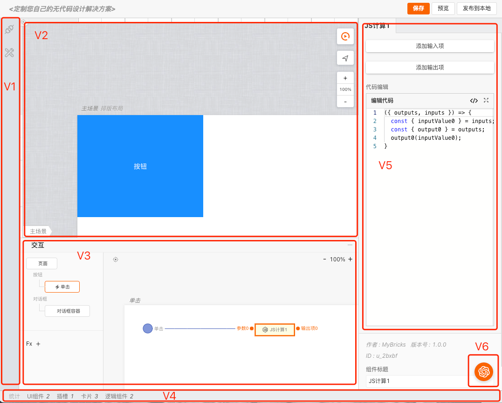

# mybricks-SPA引擎配置

>**mybricks-SPA** 是mybricks引擎家族面向单页应用的企业级设计引擎。
>
>本篇文章将介绍如何配置mybricks-SPA引擎，以便于在开发环境中使用。
>

 

## 可配置区域
如下图，mybricks-SPA支持对以下各视图区域进行配置/定制： 
 
V1:侧边栏视图 
V2:结构视图 
V3:交互视图 
V4:状态视图 
V5:属性视图 
V6:AI视图 
