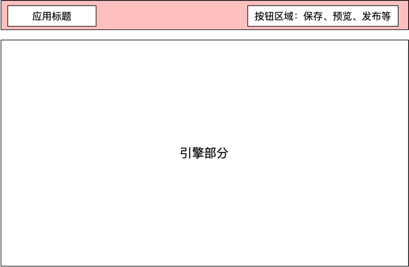

# 在代码中使用Mybricks-SPA引擎

>**mybricks-SPA** 是mybricks引擎家族面向各类页面应用场景的企业级低代码设计引擎。
>
>本篇文章介绍在前端页面(.jsx或.tsx）中使用mybricks-SPA引擎，以及如何进行配置。
>


## 在React页面中使用
> mybricks-SPA引擎目前提供的是React版本（>=17)，因此在使用前，需要先了解React的基本使用方法。<br/>
> 
> 以下是React的部分学习资料：<br/>
> [React Docs](https://legacy.reactjs.org/docs/getting-started.html#learn-react)<br/>
> [React 中文](https://zh-hans.react.dev/learn)<br/>
> [React Tutorial](https://legacy.reactjs.org/tutorial/tutorial.html)<br/>
> [React Hooks](https://legacy.reactjs.org/docs/hooks-intro.html)<br/>

### 规划我们的低代码应用
在我们的低代码应用中，我们可以通过以下方式规划我们的应用：



对应的代码如下：

```typescript jsx
export default function MyApp(){
  const designerRef = useRef()

  const save = useCallback(() => {
    const json = designerRef.current?.dump()

    window.localStorage.setItem('--mybricks--', JSON.stringify(json))
    message.info(`保存完成`)
  }, [])
  
  return (
    <>
      <div className={css.app}>
        <div className={css.toolbar}>
          <div className={css.title}>应用标题</div>
          <div className={css.btns}>
            <button onClick={save}>保存</button>
            <button onClick={preview}>预览</button>
            <button onClick={publish}>发布</button>
          </div>
        </div>
        <div className={css.designer}>
          <Designer config={}
                    ref={designerRef}
                    onMessage={}
                    onEdit={}/>
        </div>
      </div>
    </>
  )
}
```

### 引擎使用

代码示例：

```typescript jsx
// 在应用模版html文件中，通过script标签加载设计器
// <script type="text/javascript" src="https://f2.beckwai.com/kos/nlav12333/mybricks/designer-spa/1.2.78/index.min.js"></script>

// 使用在window变量上定义的设计器
const Designer = window.mybricks.SPADesigner;

<Designer config={config}         //引擎配置项
          ref={designerRef}       //引擎实例
          onMessage={onMessage}   //消息监听
          onEdit={onEdit}         //内容变更监听
          onDebug={onDebug}       //调试监听
/>
```

## 引用引擎实例（ref），API访问
> 通过ref获取引擎对应的实例，从而使用其API完成各类操作。

## 相关文档
[使用引擎API](../docs/09-API/index.md)<br/>


## 引擎配置（config）

```typescript jsx
const config = {
  plugins:[],//插件配置
  
  pageContentLoader(){},//加载编辑内容
  comLibLoader() {},//加载组件库
  comLibAdder(){},//添加组件库策略
  
  com:{},//组件环境及扩展

  geoView:{},//配置布局视图
  toplView:{},//配置交互视图
  editView:{},//配置编辑视图
  
}
```

mybricks-SPA支持对以下各视图区域进行配置/定制,如下图：<br/>
<br/>
>V1:侧边栏视图<br/>
>V2:布局视图(geoView)<br/>
>V3:交互视图(toplView)<br/>
>V4:状态视图<br/>
>V5:属性视图(editView)<br/>
>V6:AI视图<br/>

## 事件监听 (on...)

### 消息 onMessage
> 当引擎内部某些事件发生时，会通过onMessage回调函数向外部发送消息

```typescript jsx
import {message} from "antd";

const onMessage = useCallback((type, msg) => {
    message.destroy()//此处使用的是antd的message
    message[type](msg)
}, [])
```
### 内容变更 onEdit
> 当引擎中的设计内容发生变更时，会通过onEdit回调函数向外部发送消息

```typescript jsx

const onEdit = useCallback((msg) => {
  console.log(msg.title)
}, [])
```

### 调试 onDebug
> 当引擎中的设计内容发生变更时，会通过onDebug回调函数向外部发送消息

```typescript jsx

const onDebug = useCallback((msg) => {
  console.log(msg.title)
}, [])
```
