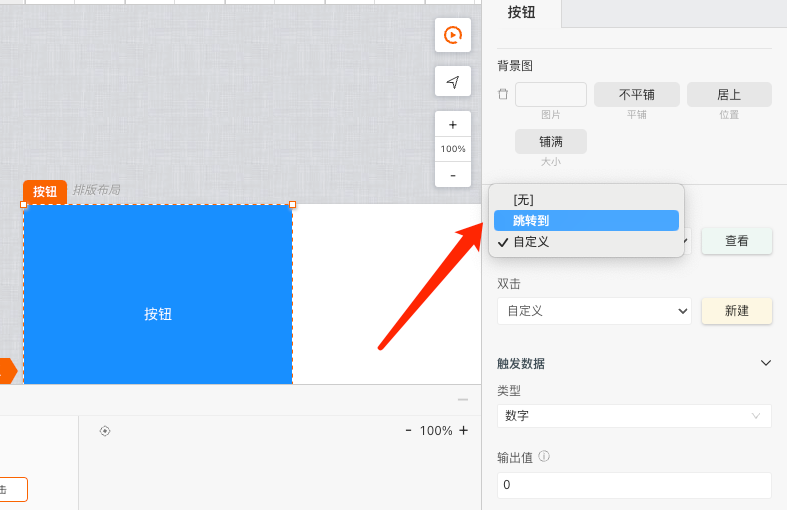
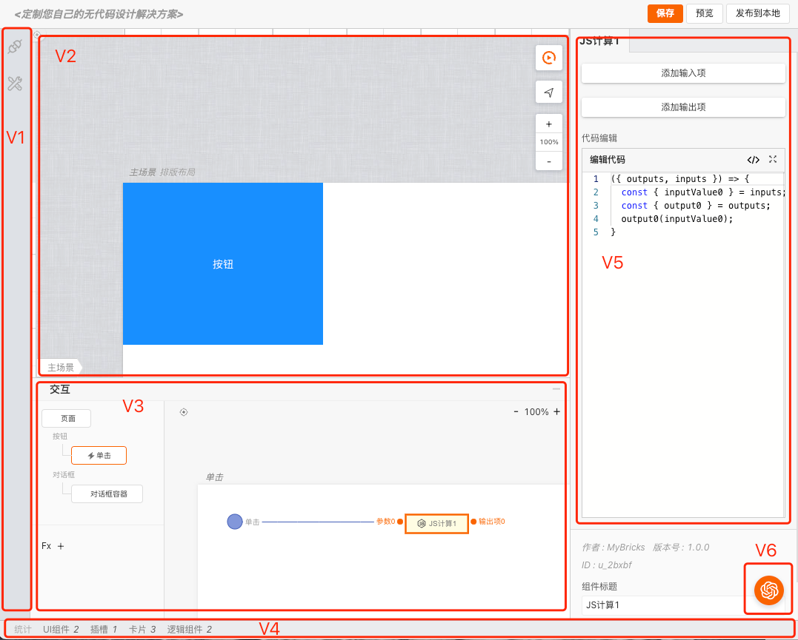

# 引擎配置

>**mybricks-SPA** 是mybricks引擎家族面向各类页面应用场景的可视化建模仿真引擎。
>
>本篇文章将介绍如何配置mybricks-SPA引擎，以便于在开发环境中使用。
>

<br/>

## 相关文档
[引擎总体配置概述](../docs/02-config-scenes/index.md)<br/>


## 引擎在React中的使用
> mybricks-SPA引擎目前提供的是React版本，因此在使用mybricks-SPA引擎之前，需要先了解React的基本使用方法。

```typescript jsx
<Designer config={config} ref={designerRef} onMessage={onMessage}/>
//config 引擎配置项，designerRef 引擎实例
```

## 事件监听（on...）部分
mybricks-SPA引擎的监听包括：
```typescript jsx
<SPADesigner config={config}
             ref={designerRef}
             onMessage={onMessage}
             onEdit={onEdit}
             onDebug={onDebug}
/>
```
### 消息监听 onMessage
> 当引擎内部某些事件发生时，会通过onMessage回调函数向外部发送消息

```typescript jsx
import {message} from "antd";

const onMessage = useCallback((type, msg) => {
    message.destroy()//此处使用的是antd的message
    message[type](msg)
}, [])
```
### 内容变更 onEdit
> 当引擎中的设计内容发生变更时，会通过onEdit回调函数向外部发送消息

```typescript jsx

const onEdit = useCallback((msg) => {
  console.log(msg.title)
}, [])
```


## 引擎配置（config）部分
mybricks-SPA引擎的配置包括以下两大部分：
### 全局配置
> 全局配置包括了组件库加载器、文件内容加载器、组件环境及扩展等内容

#### comLibLoader（组件库加载器）[必须]
```typescript jsx
const config = {
  //...
  comLibLoader() {
    return new Promise<string[]>((resolve, reject) => {
      //加载Mybricks的PC通用组件库
      resolve([`https://f2.eckwai.com/kos/nlav12333/fangzhou/pub/comlibs/5665_1.1.12/2023-03-31_12-19-17/edit.js`])
      //resolve([testLib])//也可以加载本地组件库
    })
  }
  //...
}
```

**注意：** 
- 组件库加载器必须返回一个Promise对象;
- 组件库可以是URL地址，也可以是一个本地组件库对象;


#### comLibLoader（组件库加载器-添加自定义组件库的场景）[非必须] 
```typescript jsx
const config = {
  //...
  comLibLoader(desc) {
    if (desc) {//desc 中传递必要的命令
      if (desc.cmd === 'addCom') {//添加组件 或 更新组件、删除组件
        const selfLib = {
          comAray: [
            {
              id: 'test',
              title: '测试组件',
              version: '1.0.1',
              namespace: 'test.a',
              runtime() {
                return (
                  <div>TODO</div>
                )
              }
            }
          ],
          id: desc.libId,
          title: '我的组件库',
          defined: true
        }

        resolve(selfLib)

        return
      }
    }
    
    const selfLib = {
      comAray: [
      ],
      id: 'my',
      title: '我的组件库',
      defined: true//必须，通过此属性标识为自定义组件库
    }
    
    return new Promise<string[]>((resolve, reject) => {
      resolve([
        selfLib,
        `https://f2.eckwai.com/kos/nlav12333/fangzhou/pub/comlibs/5665_1.1.12/2023-03-31_12-19-17/edit.js`
      ])
    })
  }
  //...
}
```


#### comLibAdder（组件库添加）[非必须]
```typescript jsx
const config = {
  //...
  comLibAdder(){
    //打开选择组件库的对话框
    //对话框完成后回调：
    return new Promise((resolve) => {
      resolve(`组件库edit.js地址`)
    })
  }
  //...
}
```
**注意：**
- 组件库加载器必须返回一个Promise对象;
- 组件库可以是URL地址，也可以是一个本地组件库对象;


#### pageContentLoader（文件内容加载器）[必须]
> Mybricks的各类引擎在（编辑）内容加载、保存等方面，均已文件的形式进行。
```typescript jsx
const config = {
  //...
  pageContentLoader() {
    const pageContent = window.localStorage.getItem('--mybricks--')//本例中，直接从本地存储中加载
    return new Promise<string>((resolve, reject) => {
      let pageContent = window.localStorage.getItem('--mybricks--')
      if (pageContent) {
        pageContent = JSON.parse(pageContent)

        resolve(pageContent)
      } else {
        // resolve(null)
        // return
        import('./demo-data.json').then(data => {
          pageContent = JSON.parse(JSON.stringify(data))
          resolve(pageContent)
        })
      }
    })
  },
  //...
}
```

**注意：**
- 文件内容加载器必须返回一个Promise对象;
- 如果内容为空，返回null即可;


#### com（组件环境及扩展）[非必须]

```typescript jsx
const config = {
  //...
  com: {//配置组件运行时的环境扩展
    env: {
      i18n(title) {//多语言
        return title
      },
      callConnector(connector, params) {//调用连接器
        if (connector.type === 'http') {//服务接口类型
          return callConnectorHttp(connector, params, {
            // 发送请求前的钩子函数
            before(options) {
              return {
                ...options
              }
            }
          })
        } else {
          return Promise.reject('错误的连接器类型.')
        }
      },
      events: [//扩展除自定义之外的事件
        {
          type: 'jump',
          title: '跳转到',
          exe({options}) {//实际执行时的回调
            const page = options.page
            if (page) {
              window.location.href = page
            }
          },
          options: [
            {
              id: 'page',
              title: '页面',
              editor: 'textarea'
            }
          ]
        },
      ]
    }
  },
  //...
}
```

**注意：**
- 关于callConnector：引擎本身没有定义与外界的具体连接（例如请求接口等），需在此处声明具体的连接方式，例如调用某连接器;
- 关于events：此处的配置将出现在：



### 视图配置<br/>
mybricks-SPA支持对以下各视图区域进行配置/定制,如下图：<br/>
<br/>
>V1:侧边栏视图<br/>
>V2:结构视图<br/>
>V3:交互视图<br/>
>V4:状态视图<br/>
>V5:属性视图<br/>
>V6:AI视图<br/>

#### plugins（V1:侧边栏视图）[非必须]
侧边栏主要由插件构成，配置插件的代码样例如下：
```typescript jsx
import servicePlugin, {call as callConnectorHttp} from "@mybricks/plugin-connector-http";
const config = {
  //...
  plugins: [servicePlugin()],//配置插件
  //...
}
```
> 目前mybricks github上已经开源了几款常用的插件，包括http连接器、debug等插件。

#### geoView（V2:结构视图）[非必须]
结构视图定义了引擎在结构构成方面的主体部分：
```typescript jsx
const config = {
  //...
  geoView: {
    nav: {float: false},//导航栏（组件库及大纲视图）是否浮动
    type:'mobile',//画布类型 mobile|pc|defined
    layout: 'absolute',//画布默认布局方式 absolute|normal 绝对定位|排版布局
    width: {//初始画布宽度 对象或者数字
      init: 500,
      editable: true//是否可编辑
    },
    height: 400, //同width
    scenes: [//是否开启多场景
      {
        id: 'login',//场景id
        title: '登录',//标题
        template: {//模版（非必须）
          coms: [
            {
              namespace: 'mybricks.basic-comlib.text',//模版中的组件namespace
              deletable: false
            }
          ]
        }
      },
      {
        id: 'main',
        title: '主页'
      }
    ],
    template: {//默认模版（非必须）
      coms: [
        {
          namespace: 'mybricks.normal-pc.tabs',
          deletable: false
        }
      ]
    }
  },
  //...
}
```

#### toplView（V3:交互视图）[非必须]
结构视图定义了引擎在交互结构构成方面的主体部分：
```typescript jsx
const config = {
  //...
  toplView: {
    display:false,//是否显示，可以配置toplView但不显示，这样就可以使用debug功能
    title: '交互',//标题
    cards: {
      main: {//主卡片配置，用于声明global级别的流程定义
        title: '页面',
        ioEditable: true,//inputs、outputs是否可编辑
        _inputs: [//私有inputs 非必须
          {
            id: 'test',
            title: '测试',
            schema: {
              type: 'string'
            }
          }
        ],
        _outputs: [//私有outputs
          {
            id: 'test',
            title: '测试',
            schema: {
              type: 'string'
            }
          }
        ]
      },
    },
    vars: {},//是否开启变量
    fx: {},//是否开启fx功能
    useStrict: false,//是否开启严格模式，严格模式下将对类型做严格校验
  },
  //...
}
```

#### editView（V5:属性视图）[非必须]
属性视图定义了引擎在属性编辑方面的配置部分：

```typescript jsx
const projectData = {}//当前项目的数据，其中保存页面的dump数据等
const config = {
  editView: {
    editorAppender(editConfig) {//【非必须】对编辑器的扩展，该方法可以对已有编辑器进行覆盖
      if(editConfig.type==='abc'){//如果编辑器是abc类型,则返回自定义编辑器
        return AbcEditor({editConfig} as any)
      }
    },
    items({}, cate0, cate1, cate2) {//【非必须】对"项目"编辑面板进行声明，支持最多三个Tabs
      cate0.title = `项目1`//第一个Tab的标题
      cate0.items = [//编辑项声明
        {
          title: '权限方法',
          type: 'textarea',
          value: {
            get() {
              return projectData.permission
            },
            set(context, v: string) {
              projectData.permission = v
            }
          }
        }
      ]
    }
  }
}
```

