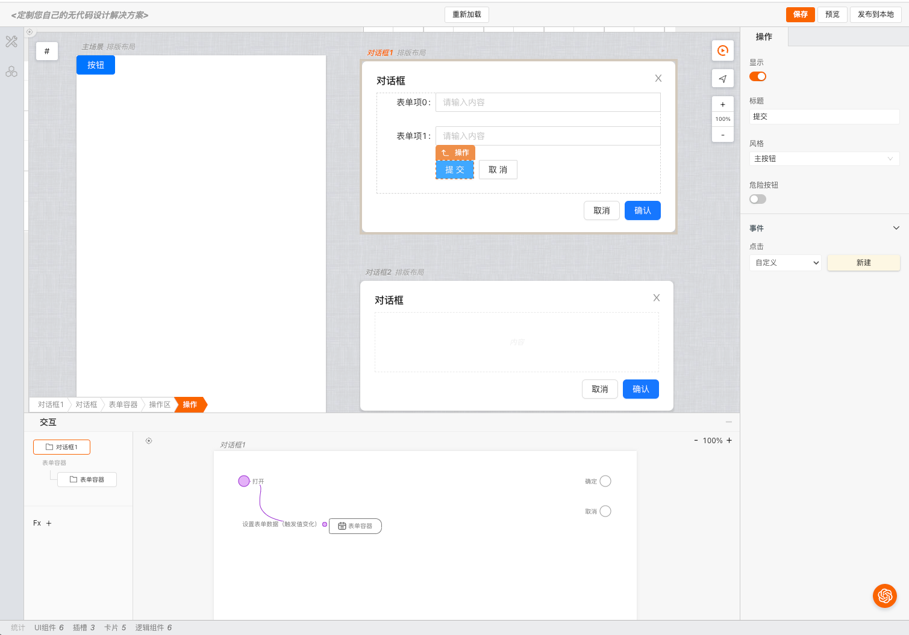

# 配置多场景

>**mybricks-SPA** 是mybricks引擎家族面向各类页面应用场景的可视化建模仿真引擎。
>
> mybricks-SPA 引擎在页面搭建时支持通过多场景（画布）的方式进行页面搭建，每个场景（画布）都可以独立的进行页面搭建，也可以通过场景（画布）之间的关联进行页面搭建。
>



## 相关文档
[引擎总体配置概述](../01-config/index.md)<br/>


#### geoView 结构视图 中配置使用多场景
代码如下：
```typescript jsx
const config = {
  //...
  geoView: {
    //【其他部分参考 配置概述 中的内容】
    scenes: {
      adder: [//可添加的场景类型
        {
          type: 'popup',//popup类型的场景
          title: '对话框',
          template: {
            namespace: 'mybricks.basic-comlib.popup',//场景中的模版
            deletable: false,//不可删除
            asRoot: true//作为根组件
          }
        }
      ]
    },
  },
  //...
}
```

#### popup类型的场景
>popup类型的场景一般用于弹出框，例如对话框、抽屉等。
>
> popup场景实际的弹窗交互由模版组件完成，例如上例中配置的
> mybricks.basic-comlib.popup
> 

关于 mybricks.basic-comlib.popup，请参考[组件源码](https://github.com/mybricks/comlib-basic/tree/main/src/popup)

