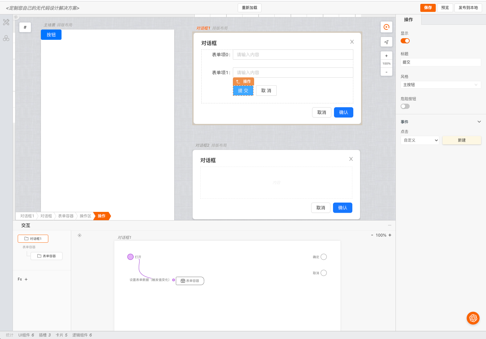

# 配置 多场景

> **mybricks-SPA** 是mybricks引擎家族面向各类页面应用场景的企业级低代码设计引擎。
>
> mybricks-SPA 引擎在页面搭建时支持通过多场景（画布）的方式进行页面搭建，每个场景（画布）都可以独立的进行页面搭建，也可以通过场景（画布）之间的关联进行页面搭建。
>



### 相关文档

[引擎总体配置概述](../01-config/index.md)<br/>
[布局视图总体配置概述](../01-config-geoview/index.md)<br/>

### geoView 结构视图 中配置使用多场景

代码如下：

```typescript jsx
const config = {
  //...
  geoView: {
    //【其他部分参考 配置概述 中的内容】
    scenes: {
      presets: [//【非必须】预设的场景列表
        {
          id: 'login',
          title: '登录',
          type: 'popup',
          template: {
            coms: [
              {
                namespace: 'mybricks.basic-comlib.text',
                deletable: false
              }
            ]
          }
        },
        {
          id: 'main',
          title: '主页',
          type: 'normal'
        }
      ],
      adder: [//【非必须】可添加的场景类型
        {
          type: 'popup',//popup类型的场景
          title: '对话框',
          template: {
            namespace: 'mybricks.basic-comlib.popup',//场景中的模版
            deletable: false,//不可删除
            asRoot: true//作为根组件
          }
        },
        {
          type: 'normal',
          title: '页面'
        }
      ]
    },
  },
  //...
}
```

### presets 预设场景

> 预设场景，指的是当项目初始化时，默认已经存在的场景。<br/>

### adder 可添加的场景

> 在布局视图的#图标中可添加的场景菜单<br/>


### 场景的类型

#### popup

> popup类型的场景一般用于弹出框，例如对话框、抽屉等。<br/>
> popup场景实际的弹窗交互由模版组件完成，例如上例中配置的
> mybricks.basic-comlib.popup <br/>
> 关于 mybricks.basic-comlib.popup，请参考[组件源码](https://github.com/mybricks/comlib-basic/tree/main/src/popup)

#### normal

> 普通类型的场景

