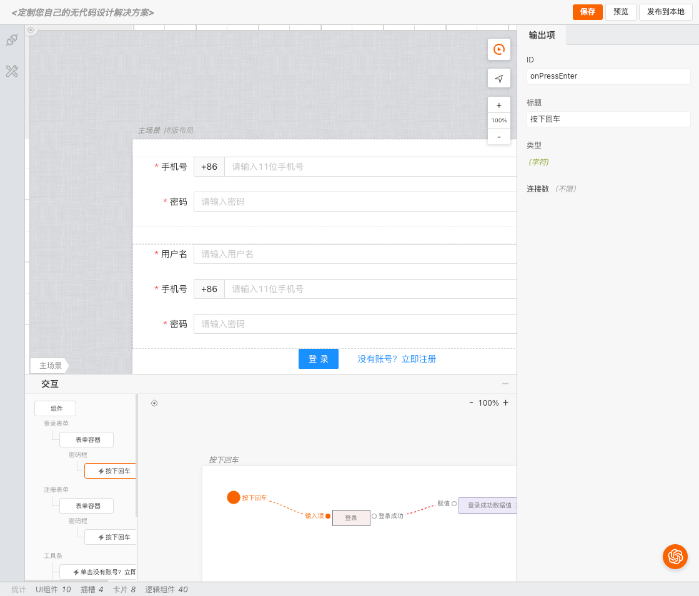
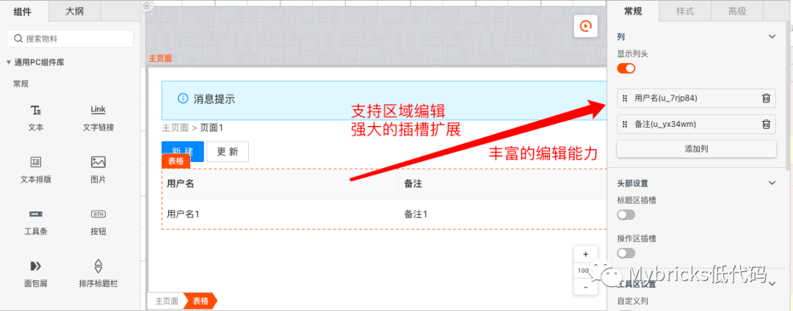
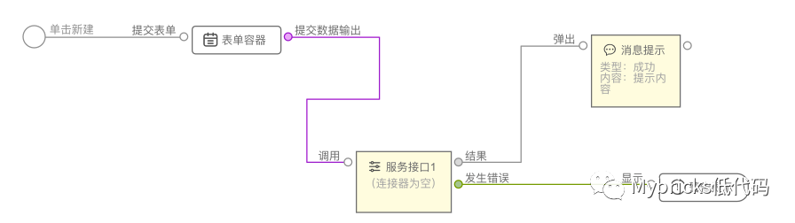
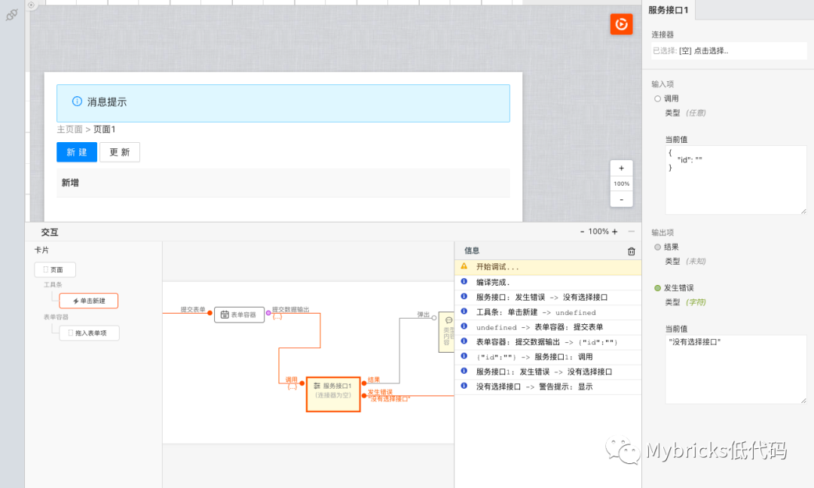
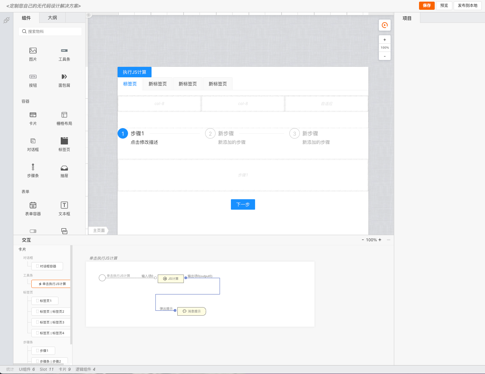

# 欢迎使用 mybricks-SPA

>**mybricks-SPA** 是mybricks引擎家族面向页面应用的企业级低代码设计引擎。
> 
>目前已经服务于包括中后台、门户页面、数据可视化、H5页面、小程序页面、图片编辑等多类业务场景。
> 
>
>

 

## 相关文档
[使用及配置概述](/docs/01-config-overview/index.md) 
 
[插件配置](/docs/02-config-plugins/index.md) 
[内容加载器配置](/docs/03-config-pagecontentloader/index.md) 
[多场景(画布)配置](/docs/02-config-scenes/index.md) 

[编辑器（Editor）与自定义编辑器](/docs/doc-editor.md) 

 

## 特性
#### 1. 所见即所得的开发体验，同时提供了对AI（chatGPT）的强大支持与扩展；

#### 2. 强大的布局能力

#### 3. 交互事件图形化编程
搭载了Mybricks-Topl图形化编程引擎，支持各类交互事件的图形化编程，包括：点击、双击、拖拽、滚动、滑动、拖拽等。

#### 4. 方便且强大的即时调试能力

## 本地快速使用

### 1. clone 工程
 > git clone git@github.com:mybricks/designer-spa-demo.git
 >

### 2. 安装依赖项
> npm install

### 3. 启动服务
> npm run dev
>

### 4. 打开浏览器，访问
> http://localhost:8000/
> 

