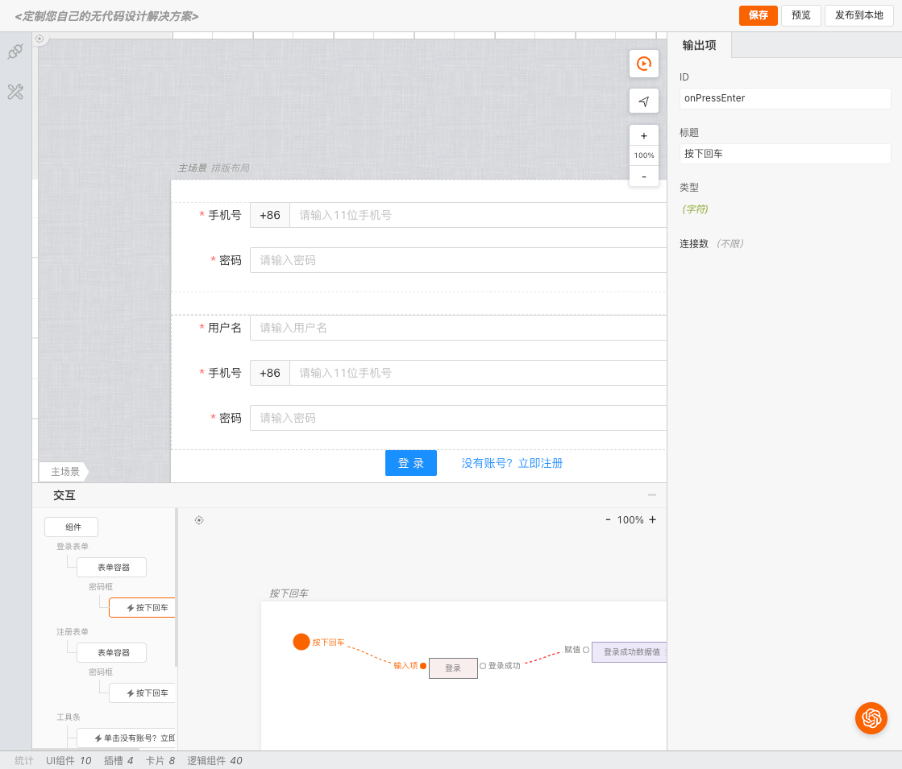
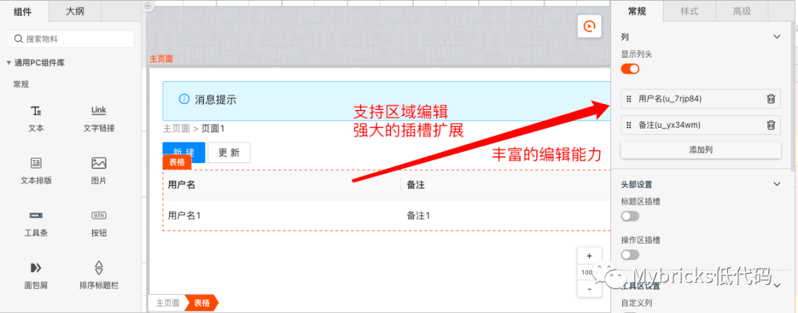
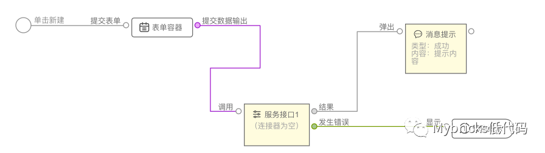
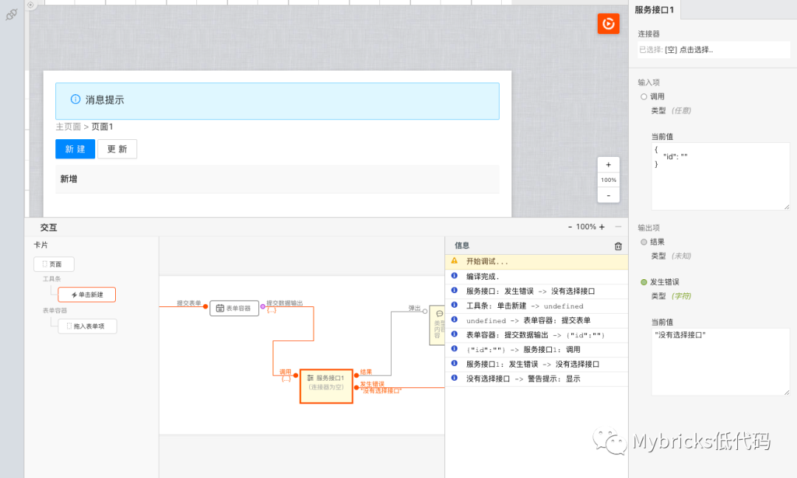
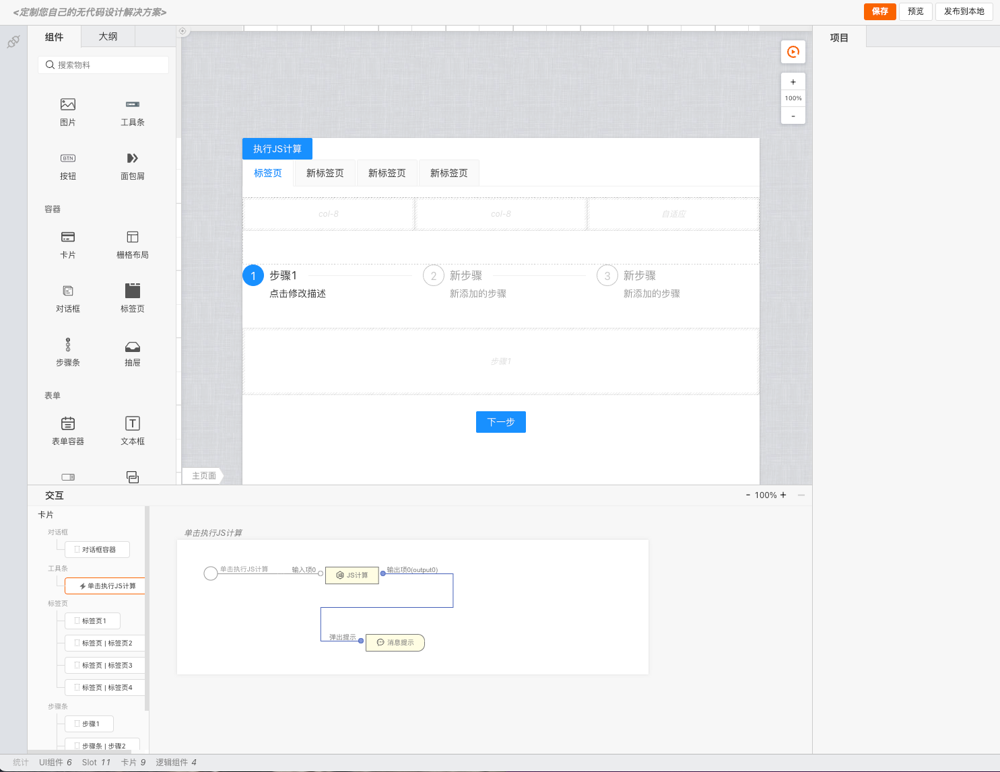

# 欢迎使用Mybricks-SPA设计引擎

>**Mybricks-SPA** 是Mybricks引擎家族面向单页应用的设计引擎。
> 
>Mybricks-SPA历经了数百次迭代，目前已经服务于几十种业务，包括中后台、门户页面、数据可视化、H5页面、小程序页面、图片编辑等各类应用场景。
> 
>

## 特性
#### 1. 所见即所得的开发体验，同时提供了对AI（chatGPT）的支持及扩展；

#### 2. 强大的布局能力

#### 3. 交互事件图形化编程
搭载了Mybricks-Topl图形化编程引擎，支持各类交互事件的图形化编程，包括：点击、双击、拖拽、滚动、滑动、拖拽等。

#### 4. 方便且强大的即时调试能力

## 使用
> (注意，使用需经过Mybricks组织授权)

### 1. clone 工程
 > git clone git@github.com:mybricks/designer-spa-demo.git
 >

### 2. 安装依赖项
> npm install

### 3. 编译应用，启动服务
> npm run dev
>

### 4. 打开浏览器，访问
> http://localhost:8000/
> 

