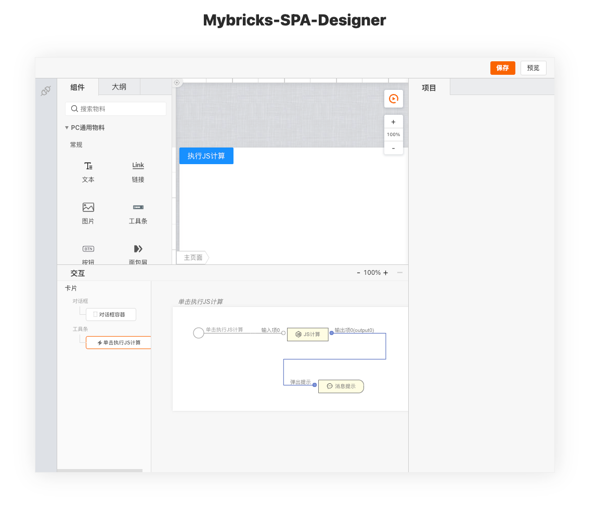

# 欢迎使用 @mybricks/designer-spa

### 1. clone 工程
 > git clone git@github.com:mybricks/designer-spa-demo.git
 >

### 2. 安装依赖项
> npm install

### 3. 编译应用，启动服务
> npm run dev
>

### 4. 打开浏览器，访问
> http://localhost:8000/
> 

